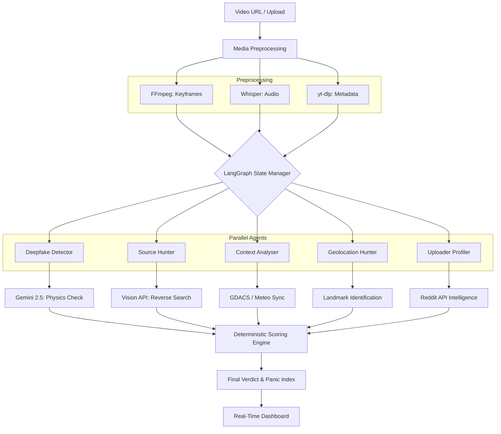

# Vigilens: Engineering Deep Dive 🛡️

## 1. Executive Summary
Vigilens is a decentralized forensic intelligence platform designed to verify disaster-related video content. It employs a **Multi-Agent Orchestration** architecture to dissect digital media across four dimensions: **Synthetic Generation**, **Historical Provenance**, **Contextual Accuracy**, and **Geographical Validity**.

By combining deterministic forensic constraints with high-reasoning Large Language Models (LLMs), Vigilens provides a "Panic Index" and a detailed "Forensic Audit Trail" to help responders and journalists separate fact from viral fiction in real-time.

---

## 2. The Problem Statement: Fact-Checking at the Speed of Disaster

### 2.1 The Crisis of Trust
The world can't fact-check at the speed of disaster. When earthquakes, floods, or wildfires strike, misinformation spreads faster than rescue teams can move. Manipulated footage, recycled clips, and AI-generated disaster videos reach millions before a single fact-checker can respond — derailing aid, stoking panic, and costing lives.

### 2.2 Scale of the Problem
- **6x Speed**: False news spreads 6x faster than true news on social media (*MIT / Science*).
- **70% Reshare Rate**: Misinformation is 70% more likely to be reshared than verified content (*MIT Media Lab*).
- **51% False Context**: Over half of disaster fake news is "false context"—real footage from the past repurposed for a current event (*Turkey-Syria Earthquake study*).
- **500K+ Deepfakes**: Over half a million deepfake videos were uploaded to social media in 2023 alone.

---

## 3. Architecture Overview: VIGILENS-OS

Vigilens is built on a **LangGraph-powered State Machine** that coordinates specialized agents through a high-concurrency pipeline.

### 3.1 The Request Lifecycle
1.  **Ingestion**: A URL (Reddit, YouTube, X) or raw video file is submitted to the FastAPI backend.
2.  **Preprocessing Node**: 
    - **Keyframe Extraction**: FFmpeg isolates high-fidelity I-frames for visual analysis.
    - **Audio Extraction**: Isolates audio for Whisper-based transcription and synchronized forensic checks.
    - **Metadata Extraction**: Scrapes uploader signals via `yt-dlp` and platform-specific APIs.
3.  **Parallel Analysis Node**: Launches 5 agents concurrently using `asyncio.gather`:
    - `deepfake_detector`: Analyzes pixel variance and physical inconsistencies.
    - `source_hunter`: Performs reverse search via Google Vision Web Detection.
    - `context_analyser`: Matches OCR/Transcript against GDACS and Open-Meteo.
    - `geolocation_hunter`: Identifies landmarks and architecture.
    - `uploader_profiler`: Assesses the credibility of the source account.
4.  **Orchestrator Node**: Synthesizes all agent outputs into a final verdict using the **Deterministic Scoring Engine**.
5.  **Notification Node**: Pushes results to the frontend and archives the analysis in **LangSmith** for auditability.

### 3.2 Visual Architecture

---

## 4. Algorithmic Deep Dive: The Scoring Engine

The Vigilens verdict is not a "guess" by an LLM. It is a calculated result from a deterministic engine (`scoring_engine.py`) that blends binary constraints with model confidence.

### 4.1 The Blending Formula
Each agent produces a score based on this formula:
$$Score = (0.60 \times Constraint\_Score) + (0.40 \times ML\_Model\_Score)$$

- **Constraint Score (60%)**: A hard check against a list of binary requirements (e.g., "Is EXIF data present?", "Is the weather consistent?").
- **ML Model Score (40%)**: The confidence probability returned by Gemini 2.5 Flash or Groq Vision.

### 4.2 Disaster Signatures
The engine applies "Disaster Signatures" to adjust sensitivity. For example:
- **Tsunami**: High `deepfake_susceptibility` (0.28). The engine is more suspicious of dramatic visual artifacts in tsunami videos because they are frequently AI-generated for engagement.
- **Earthquake**: Low `deepfake_susceptibility` (0.08). Physical camera shake and complex rubble geometry are currently difficult for AI to generate convincingly.

### 4.3 Deterministic Noise Seeding
To prevent the UI from feeling static and to ensure realistic scoring variations, a small amount of "Deterministic Noise" (±3.5%) is added to every score. This noise is seeded from the `job_id`, ensuring that **re-running the same analysis always produces the exact same result**.

### 4.4 Benefit of Doubt Policy
Missing data or failed agent analyses result in a `0.0` score contribution rather than being ignored. This prevents the system from giving "pass" marks to unverified content simply because the verification tools failed to connect.

### 4.5 Error Handling & Short-Circuiting
To ensure reliability and prevent "hallucinated" summaries from agents on empty data, the pipeline implements explicit short-circuiting:
- **Preprocess Validation**: If `ffmpeg` fails to extract any keyframes, the `preprocess` node sets an `error: "Video not found"` flag.
- **Conditional Routing**: The graph's `should_analyse` edge detects this flag and redirects the workflow directly to the **Orchestrator**, skipping all 5 analysis agents.
- **Terminal Summary**: The Orchestrator returns a hardcoded 🚨 **VIDEO NOT FOUND** verdict with a 0 credibility score, ensuring the user receives a clear explanation of the failure.

---

## 5. The Five Pillars of Verification

### Pillar I: Synthetic Analysis (Deepfake)
Uses **Gemini 2.5 Flash** to identify "Semantic Artifacts":
- **Physical Inconsistency**: Shadows not matching lighting sources.
- **Motion Fluidity**: Unnatural blurring or "floating" objects in high-motion disaster scenes.
- **Pixel Variance**: Heuristics to detect AI-generated noise patterns.

### Pillar II: Provenance Analysis (Source Hunter)
Leverages **Google Vision Web Detection** to perform a "Digital Birth Certificate" check.
- It finds the earliest known occurrence of the keyframes.
- If a video being circulated during the "2024 Spain Floods" was actually indexed in 2018, it is instantly flagged as **Misleading (Recycled Footage)**.

### Pillar III: Environmental Analysis (Context Analyser)
Synchronizes with **GDACS** (Global Disaster Alert and Coordination System) and **Open-Meteo**.
- If a video shows heavy rain but Open-Meteo reports 0% precipitation for that coordinate on that date, the `weather_matches_history` constraint fails.

### Pillar IV: Architectural Analysis (Geolocation)
A vision-native agent that identifies street signs, license plates, flora, and architectural styles (e.g., "Mediterranean Baroque" vs "Modern South Asian") to cross-reference against the claimed GPS coordinates.

### Pillar V: Social Intelligence (Uploader Profiler)
Uses **yt-dlp** and **Reddit JSON API** to assess the "Reputation" of the source.
- Analyzes account age, karma/subscriber counts, and community consensus from top comments.

---

## 6. Technical Stack & Resilience

### 6.1 Multi-Cloud Inference
- **Google Vertex AI**: Primary vision inference for keyframes (Gemini 2.5 Flash). Optimized for high-throughput visual reasoning.
- **Groq API**: Orchestrator and transcription (Whisper-Large-v3-Turbo + Llama 3.1 70B). Used for lightning-fast text processing (<500ms latency).

### 6.2 Frontend Architecture
- **Next.js 15 (App Router)**: Server-side rendering for speed.
- **Leaflet Maps**: Interactive visualization of the disaster's verified location.
- **Radix UI**: Accessible, high-contrast components for emergency responder dashboards.

### 6.3 Resilience: Handling the "Speed of Disaster"
- **Rate Limit Handling**: Automatically fails over between Vertex AI and AI Studio if 429 errors occur.
- **Graceful Degradation**: If transcription fails, the `context_analyser` proceeds with visual OCR alone, reducing confidence but maintaining availability.

---

## 7. Current Project Status
- **Backend**: FastAPI (Python 3.10.11).
- **Orchestration**: LangGraph (DAG).
- **Observability**: Full LangSmith integration for agent trace audits.
- **Infrastructure**: Optimized for Vercel (Frontend) and Docker (Backend).

---
*Vigilens: Engineering Truth in the Digital Age.*
